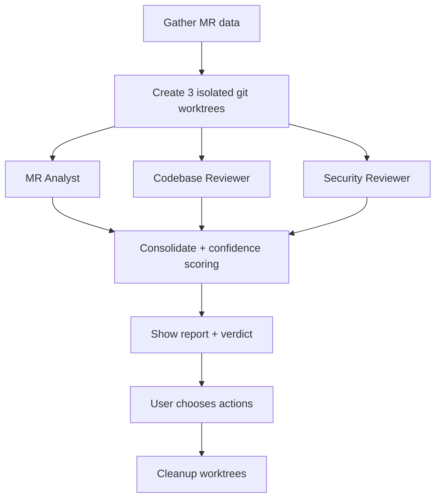

<p align="center">
  <h1 align="center">OmniForge</h1>
  <p align="center">
    <strong>AI-powered merge request toolkit for GitLab</strong><br/>
    Review with 3 adversarial agents, auto-fix findings, and create MRs faster.
  </p>
  <p align="center">
    <a href="#quick-start">Quick Start</a> •
    <a href="#what-you-get">What You Get</a> •
    <a href="#how-it-works">How It Works</a> •
    <a href="#commands">Commands</a> •
    <a href="#contributing">Contributing</a>
  </p>
  <p align="center">
    <a href="https://github.com/nexiouscaliver/OmniForge/releases/latest"></a>
    <a href="https://github.com/nexiouscaliver/OmniForge/blob/main/LICENSE"></a>
    
    
    
    <a href="https://github.com/nexiouscaliver/OmniForge/pulls"></a>
  </p>
</p>

---

## Why OmniForge?

Code reviews often fail for the same reasons: reviewer fatigue, inconsistent depth, slow fix cycles, and weak MR descriptions.

**OmniForge automates the full lifecycle**:

- **Review better** with 3 independent agents in parallel
- **Fix faster** with triage + guided patching + verification
- **Create cleaner MRs** with auto-generated metadata from commits
- **Stay safe** with explicit user approval gates and no silent posting

---

<a id="what-you-get"></a>

## ✨ What You Get

| Skill | Command | What it does |
|---|---|---|
| **OmniReview** | `/omnireview-gitlab` | Multi-agent adversarial MR review with confidence-scored findings |
| **OmniFix** | `/omnifix-gitlab` | Validates findings, applies approved fixes, verifies changes, resolves threads |
| **OmniCreate** | `/omnicreate-gitlab` | Creates GitLab MRs with auto-filled title/description from commits |

---

<a id="quick-start"></a>

## 🚀 Quick Start

### 1) Prerequisites

- [Claude Code](https://claude.ai/code)
- Python 3.10+ available as `python3` on your `PATH` (required to launch the MCP server)
- [`uv`](https://astral.sh/uv/) (for MCP server runtime dependencies; `python3` must still be available locally)
- [`glab`](https://gitlab.com/gitlab-org/cli#installation) (authenticated via `glab auth login`)
- Git 2.15+ (worktree support)
- Any local GitLab repository

### 2) Install (recommended)

```bash
# Add OmniForge marketplace source
claude plugin marketplace add https://github.com/nexiouscaliver/OmniForge.git

# Install plugin
claude plugin install omniforge@omniforge-marketplace
```

### 3) Restart Claude Code session

Plugins are loaded at session start.

### 4) Run your first review

Open a local GitLab repository in Claude Code, then run:

```text
/omnireview-gitlab 136
```

---

<a id="commands"></a>

## 🧭 Commands

| Command | Purpose | Typical use |
|---|---|---|
| `/omnireview-gitlab <mr_id>` | Review an MR with 3 parallel agents | `/omnireview-gitlab 136` |
| `/omnifix-gitlab <mr_id>` | Fix unresolved findings with approval gate | `/omnifix-gitlab 136` |
| `/omnicreate-gitlab [flags]` | Create MR from current branch | `/omnicreate-gitlab --draft -l bug` |

<details>
<summary><strong>OmniCreate useful flags</strong></summary>

- `--draft` mark as draft
- `-b <branch>` target branch
- `-a <username>` assign user
- `-l <labels>` comma-separated labels
- `-i <issue_id>` link issue
- `--copy-issue-labels` copy labels from linked issue

</details>

---

<a id="how-it-works"></a>

## 🧠 How It Works

### Review pipeline (`/omnireview-gitlab`)



### Confidence model

| Score | Meaning | Included |
|---|---|---|
| 90-100 | Verified with code evidence | ✅ |
| 70-89 | Strong signal + clear evidence | ✅ |
| 50-69 | Possible issue | ❌ |
| <50 | Likely noise | ❌ |

### Action menu (after review)

Post summary, post inline findings, open linked issues, approve MR, open browser, re-review focused areas, verify specific concerns, or finish.

---

## 🛠️ MCP Tools

OmniForge ships a FastMCP server (`plugins/omniforge/tools/omniforge_mcp_server.py`) with **13 tools** used by skills for speed and reliability.

| Capability | Tool examples |
|---|---|
| MR data + diff processing | `fetch_mr_data`, `map_diff_lines` |
| Worktree orchestration | `create_review_worktrees`, `cleanup_review_worktrees`, `cleanup_omnifix_worktrees` |
| MR discussion interactions | `post_full_review`, `post_review_summary`, `post_inline_thread`, `reply_to_discussion`, `resolve_discussion` |
| Issue / MR operations | `create_linked_issue`, `create_gitlab_mr` |

**Security defaults:** argument-list subprocess execution (`create_subprocess_exec`), strict input validation, bounded diff handling, and no AI attribution in posted review comments.

---

## 📦 Installation Options

<details>
<summary><strong>Option B: local plugin directory (dev/testing)</strong></summary>

```bash
claude --plugin-dir /path/to/OmniForge/plugins/omniforge
```

</details>

<details>
<summary><strong>Option C: manual personal skill install (no MCP server)</strong></summary>

```bash
# 1) Clone
git clone https://github.com/nexiouscaliver/OmniForge.git

# 2) OmniReview
mkdir -p ~/.claude/skills/omnireview-gitlab/references
cp OmniForge/plugins/omniforge/skills/omnireview-gitlab/SKILL.md ~/.claude/skills/omnireview-gitlab/
cp OmniForge/plugins/omniforge/skills/omnireview-gitlab/references/* ~/.claude/skills/omnireview-gitlab/references/

# 3) OmniFix
mkdir -p ~/.claude/skills/omnifix-gitlab/references
cp OmniForge/plugins/omniforge/skills/omnifix-gitlab/SKILL.md ~/.claude/skills/omnifix-gitlab/
cp OmniForge/plugins/omniforge/skills/omnifix-gitlab/references/* ~/.claude/skills/omnifix-gitlab/references/

# 4) OmniCreate
mkdir -p ~/.claude/skills/omnicreate-gitlab
cp OmniForge/plugins/omniforge/skills/omnicreate-gitlab/SKILL.md ~/.claude/skills/omnicreate-gitlab/

# 5) Cleanup
rm -rf OmniForge
```

Manual install works, but MCP-backed install is faster and better error-handled.

</details>

<details>
<summary><strong>Update / uninstall</strong></summary>

```bash
# Update
claude plugin marketplace update omniforge-marketplace
claude plugin update omniforge

# Uninstall
claude plugin uninstall omniforge
claude plugin marketplace remove omniforge-marketplace
```

</details>

---

## 🔒 Safety Model

- `/omnireview-gitlab` is read-only against your working tree
- `/omnifix-gitlab` requires explicit user approval before any code changes
- Review posting actions are user-selected (no automatic posting)
- Temporary worktrees are always cleaned up at the end

---

## 🗂️ Project Structure

```text
OmniForge/
  .claude-plugin/marketplace.json
  plugins/omniforge/
    .claude-plugin/plugin.json
    .mcp.json
    skills/
      omnireview-gitlab/
      omnifix-gitlab/
      omnicreate-gitlab/
    tools/omniforge_mcp_server.py
    tests/
```

---

## ❓ FAQ

**Does OmniForge modify my code automatically?**  
No. Review is read-only. Fixing requires explicit approval.

**Does OmniForge post comments without asking?**  
No. You choose what gets posted from the action menu.

**Does it support self-hosted GitLab?**  
Yes, if `glab` is configured for your host.

**How long does review take?**  
Usually 2–5 minutes depending on MR size.

---

## 🛣️ Roadmap

Planned platform/tool expansion:

- GitHub PR support via `gh`
- Cursor integration
- Gemini CLI compatibility
- OpenCode support
- Kilo Code integration

---

<a id="contributing"></a>

## 🤝 Contributing

Contributions are welcome: bug fixes, platform support, docs, tests, and prompt quality improvements.

- Start here: [CONTRIBUTING.md](CONTRIBUTING.md)
- Browse open work: [Issues](https://github.com/nexiouscaliver/OmniForge/issues)
- Open PRs: [Pull requests](https://github.com/nexiouscaliver/OmniForge/pulls)

---

## 📄 License

MIT — see [LICENSE](LICENSE).

---

<p align="center">
  Built by <a href="https://github.com/nexiouscaliver"><strong>Shahil Kadia</strong></a><br/>
  If OmniForge helps your team ship safer MRs, consider starring the repo ⭐
</p>
