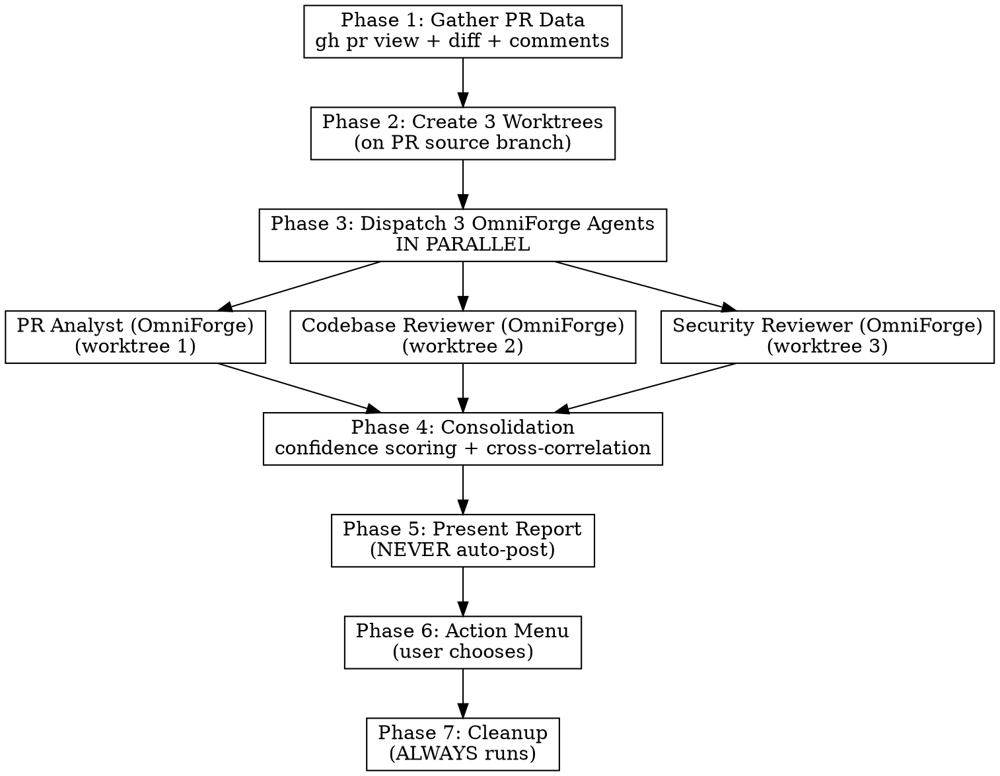

# OmniForge

> **Multi-agent adversarial PR review — 3 parallel agents, 3 worktrees, 1 consolidated report.**

Dispatch 3 parallel specialized agents in isolated git worktrees to perform adversarial, independent analysis of a GitHub PR. Consolidate findings via confidence scoring, present actionable report, then offer structured actions (comment, create issues, approve).

**Core principle:** Independent adversarial review + confidence filtering + worktree isolation = high-signal feedback with minimal noise.

**Announce at start:** "I'm using OmniForge to review PR #{id}."

## Prerequisites

- `gh` CLI authenticated (`gh auth status` to verify)
- Git repository with remote pointing to GitHub
- Current working directory is in the git repo

## Input Parsing

Accept any of: PR number (`136`), prefixed (`#136`), or full GitHub URL.
Extract PR ID. If URL provided, extract owner/repo and PR number.

## The Process



---

## Phase 1: Gather PR Data

Fetch ALL data before dispatching agents. Agents get data injected — they never re-fetch.

**If MCP tools are available** (plugin install), use the single tool call:

```
mcp__omniforge__fetch_pr_data(pr_id="{id}", repo_root="{cwd}")
```

Returns a structured JSON package with: pr_id, title, author, source_branch, target_branch, pipeline_status, description, comments, diff, diff_line_count, diff_too_large, diff_truncated, **diff_line_map**, commits, files_changed, labels, assignees, reviewers.

**IMPORTANT: `diff_line_map` is already included in this response.** It contains exact changed line numbers per file (added_lines, all_new_lines, hunks). When posting inline threads, use these line numbers directly — do NOT call `map_diff_lines` separately. The standalone `map_diff_lines` tool is only for re-parsing if you have a diff string from another source.

If `diff_too_large` is true, the diff is auto-truncated to 10,000 lines. Agents explore full files in their worktrees instead.

**Error handling:** If the tool returns `success: false`, check `error_type`:
- `auth_failure` — Tell user to run `gh auth login`
- `pr_not_found` — Verify PR number and repository
- `validation_error` — Check input format

**Fallback (personal skill install without MCP server):** Use bash commands directly:

```bash
gh auth status
gh pr view {id} --json title,author,headRefName,baseRefName,body,comments,reviews,labels,assignees,reviewRequests
gh pr diff {id}
git fetch origin {source_branch} {target_branch}
git log --oneline origin/{target_branch}..origin/{source_branch}
```

### Large Diff Strategy

When `diff_line_count` is high (>3000 lines) or `diff_truncated` is true:

1. **Don't inject the full diff into agent prompts.** Save the diff to a temp file and give agents the file path. They can read sections as needed.
2. **Provide a diff summary instead.** Use `files_changed` and `diff_line_map` to create a per-file summary table:
   ```
   | File | Added Lines | Hunks |
   |------|-------------|-------|
   | src/app.py | 42 | 3 |
   | tests/test_app.py | 28 | 2 |
   ```
3. **Agents explore in worktrees.** With the summary + worktree access, agents can read full files and understand context without the raw diff consuming their context window.
4. **Save diff to temp file pattern:**
   ```bash
   # Save diff for agents to read on-demand
   echo "$DIFF_TEXT" > /tmp/omni_pr{id}_diff.txt
   # Give agents the path, not the content
   ```
5. **Clean up temp files in Phase 7** alongside worktree cleanup.

This approach reduces agent context usage by 50-80% on large PRs while preserving full review quality.

---

## Phase 2: Create 3 Worktrees

**REQUIRED SUB-SKILL:** Follow `superpowers:using-git-worktrees` pattern.

**If MCP tools are available** (plugin install), use the single tool call:

```
mcp__omniforge__create_review_worktrees(
    mr_id="{id}",
    source_branch="{from Phase 1 response}",
    repo_root="{cwd}"
)
```

Returns absolute paths for all 3 worktrees:
- `worktrees.analyst` — PR Analyst (OmniForge)
- `worktrees.codebase` — Codebase Reviewer (OmniForge)
- `worktrees.security` — Security Reviewer (OmniForge)

The tool automatically: ensures `.worktrees/` exists and is gitignored, cleans stale worktrees from crashed runs, fetches the source branch, creates 3 detached worktrees, resolves absolute paths.

**Error handling:** If creation fails partway, the tool auto-cleans any partially created worktrees and returns `cleanup_performed: true`.

**Fallback (personal skill install without MCP server):**

```bash
# Resolve main repo root (handles linked worktrees)
MAIN_ROOT=$(git rev-parse --git-common-dir 2>/dev/null)
if [ -n "$MAIN_ROOT" ]; then MAIN_ROOT=$(cd "$(dirname "$MAIN_ROOT")" && pwd); else MAIN_ROOT=$(pwd); fi
cd "$MAIN_ROOT"

mkdir -p .worktrees
git check-ignore -q .worktrees 2>/dev/null || echo ".worktrees/" >> .gitignore
git worktree remove .worktrees/omni-analyst-{id} --force 2>/dev/null
git worktree remove .worktrees/omni-codebase-{id} --force 2>/dev/null
git worktree remove .worktrees/omni-security-{id} --force 2>/dev/null
git worktree prune
git fetch origin {source_branch}
git worktree add .worktrees/omni-analyst-{id} origin/{source_branch} --detach
git worktree add .worktrees/omni-codebase-{id} origin/{source_branch} --detach
git worktree add .worktrees/omni-security-{id} origin/{source_branch} --detach
ANALYST_PATH=$(cd .worktrees/omni-analyst-{id} && pwd)
CODEBASE_PATH=$(cd .worktrees/omni-codebase-{id} && pwd)
SECURITY_PATH=$(cd .worktrees/omni-security-{id} && pwd)
```

---

## Phase 3: Dispatch 3 OmniForge Agents in Parallel

**REQUIRED SUB-SKILL:** Use `superpowers:dispatching-parallel-agents` pattern.

Dispatch all 3 agents simultaneously using the **Agent tool** (NOT TaskCreate — the Agent tool spawns subagents). Send a single message with 3 parallel Agent tool calls. Each agent gets:
- Full PR context package (injected, NOT fetched by agent)
- Its own worktree **absolute** path for exploration
- Agent-specific review prompt (from template file)
- PR comments/discussions (all 3 agents, not just the PR Analyst)
- Confidence scoring instructions

### Agent 1: PR Analyst (OmniForge)
- **Template:** `./references/mr-analyst-prompt.md`
- **Worktree:** `.worktrees/omni-analyst-{id}`
- **Focus:** Process quality — commit-by-commit analysis, PR description, discussions, scope

### Agent 2: Codebase Reviewer (OmniForge)
- **Template:** `./references/codebase-reviewer-prompt.md`
- **Worktree:** `.worktrees/omni-codebase-{id}`
- **Focus:** Code quality — architecture, logic, testing, patterns, DRY, performance

### Agent 3: Security Reviewer (OmniForge)
- **Template:** `./references/security-reviewer-prompt.md`
- **Worktree:** `.worktrees/omni-security-{id}`
- **Focus:** Security — OWASP Top 10, secrets, auth/authz, injection, data exposure

**Model selection:** Use the most capable model available (opus) for all 3 agents. Review requires judgment, not just mechanical work.

### Agent Prompt Construction

For each agent, fill the template placeholders:
- `{MR_ID}` — PR number
- `{MR_TITLE}` — PR title from JSON
- `{WORKTREE_PATH}` — **Absolute** path to agent's worktree (convert from relative)
- `{MR_JSON_DATA}` — Full JSON metadata (all 3 agents get this)
- `{MR_DESCRIPTION}` — PR description text
- `{MR_COMMENTS}` — All discussion threads (all 3 agents get this — discussions may contain security/code context)
- `{MR_DIFF}` — Raw diff output
- `{COMMIT_LIST}` — Commit SHAs and messages
- `{FILES_CHANGED_LIST}` — List of changed file paths
- `{SOURCE_BRANCH}` — PR source branch name
- `{TARGET_BRANCH}` — PR target branch name

---

## Phase 4: Consolidation

**Threshold: 70.** Only findings with confidence >= 70 appear in the final report.

**REQUIRED REFERENCE:** `./references/consolidation-guide.md` — you MUST read this before consolidating. Contains the full algorithm: confidence scoring, cross-correlation (+15 for 2 agents, +25 for 3), false positive auto-reduction (-30), deduplication, verdict logic, report template, and agent agreement matrix. Do NOT attempt consolidation from memory — the algorithm has specific rules that must be followed exactly.

---

## Phase 5: Present Report

```markdown
## OmniForge Report: #{id} — {title}

**Branch:** {source} → {target} | **Author:** {author} | **Pipeline:** {status}

### Summary
[1-3 sentence executive summary: overall assessment, key risks]

### Verdict: [APPROVE | APPROVE_WITH_FIXES | REQUEST_CHANGES | BLOCK]

### Strengths
[Specific things done well with file:line references]

### Issues

#### Critical (Must Fix Before Merge)
[Bugs, security vulnerabilities, data loss risks]
Each: file:line | description | why it matters | how to fix | confidence | source agent(s)

#### Important (Should Fix)
[Architecture problems, missing edge cases, test gaps]

#### Minor (Nice to Have)
[Optimizations, documentation, code clarity]

### PR Process Notes
[From PR Analyst (OmniForge): commit quality, description, unresolved discussions]

### Security Assessment
[From Security Reviewer (OmniForge): OWASP findings, posture assessment]

### Recommendations
[Future improvements beyond this PR's scope]

### Agent Agreement Matrix
| File/Area | PR Analyst (OmniForge) | Codebase (OmniForge) | Security (OmniForge) | Consensus |
```

**CRITICAL: Present the report FIRST. Never auto-post anything.**

---

## Phase 6: Action Menu

After presenting the full report, offer structured actions:

```
What would you like to do?

1. Full review post — summary comment + inline review threads (Recommended)
2. Post summary only (overview comment, no inline threads)
3. Post inline findings only (review threads, no summary)
4. Create GitHub issues for Critical/Important items
5. Approve the PR
6. Open PR in browser
7. Re-review a specific area (single focused agent)
8. Verify a specific concern (run a targeted check)
9. Done — no action needed
```

Wait for user choice. Execute chosen action(s). Return to menu until user selects "Done".

### Option 1: Full Review Post (Recommended)

Post summary comment + individual inline review threads for each finding >= 70 confidence. Each finding gets its own thread for independent resolution.

**REQUIRED REFERENCE:** `./references/posting-guide.md` — you MUST read this before posting anything. Contains the summary comment template, inline thread template, MCP tool call syntax (`post_pr_full_review` findings JSON format), and bash fallback commands. Do NOT improvise posting format — use the exact templates from the reference.

### Option 4: Create GitHub Issues

Use `gh issue create` for each Critical/Important item. GitHub has no `--linked-pr` equivalent — link the issue to the PR manually by mentioning the PR number in the issue body:

```bash
gh issue create --title "{issue_title}" --body "Found in PR #{id}: {finding_description}

File: {file_path}:{line_number}
Confidence: {confidence}/100
Source: {agent_name}

See PR #{id} for full context."
```

---

## Phase 7: Cleanup

**ALWAYS runs, regardless of success or failure.**

**If MCP tools are available:**

```
mcp__omniforge__cleanup_review_worktrees(mr_id="{id}", repo_root="{cwd}")
```

The tool force-removes all 3 worktrees, cleans leftover directories, and prunes git worktree references. Reports what was removed vs. already clean.

**Fallback (personal skill install without MCP server):**

```bash
# Resolve main repo root (handles linked worktrees)
MAIN_ROOT=$(git rev-parse --git-common-dir 2>/dev/null)
if [ -n "$MAIN_ROOT" ]; then MAIN_ROOT=$(cd "$(dirname "$MAIN_ROOT")" && pwd); else MAIN_ROOT=$(pwd); fi
cd "$MAIN_ROOT"

git worktree remove .worktrees/omni-analyst-{id} --force 2>/dev/null
git worktree remove .worktrees/omni-codebase-{id} --force 2>/dev/null
git worktree remove .worktrees/omni-security-{id} --force 2>/dev/null
rm -rf .worktrees/omni-analyst-{id} .worktrees/omni-codebase-{id} .worktrees/omni-security-{id} 2>/dev/null
git worktree prune
```

---

## Error Handling

| Error | Response |
|-------|----------|
| gh not authenticated | "Run `gh auth login` first." Stop. |
| PR not found | "PR #{id} not found. Verify the number and repository." Stop. |
| Network failure | Retry gh command once. If still fails, report error and stop. |
| Worktree creation fails | Try with timestamp suffix. If still fails, clean up and stop. |
| 1 agent fails | Continue with 2/3. Note gap in report. |
| 2+ agents fail | Present partial results. Suggest manual review. |
| Diff too large | Summarize diff. Give agents file list to explore in worktrees. |
| Cleanup fails | Force remove directories. Report if still stuck. |

**Cleanup guarantee:** The entire flow is wrapped in a try/finally pattern. Phase 7 runs no matter what.

---

## Quick Reference

| Phase | What | How |
|-------|------|-----|
| 1. Gather | Fetch PR data | `gh pr view/diff` (JSON + raw) |
| 2. Setup | Create 3 worktrees | `git worktree add --detach` (×3) |
| 3. Review | Dispatch OmniForge agents | Agent tool parallel (×3, opus model) |
| 4. Merge | Consolidate findings | Confidence score + cross-correlate + dedup |
| 5. Report | Present OmniForge report | Structured markdown with verdict |
| 6. Act | User chooses | `gh pr comment/approve`, `gh issue create` |
| 7. Clean | Remove worktrees | `git worktree remove --force` (×3) + prune |

---

## The "Small PR" Trap

```
EVERY PR gets the full OmniForge process. No exceptions.
```

The most dangerous rationalization is: "This PR is small/simple, I'll just do a quick review." This is exactly when issues get missed — when you assume simplicity means safety.

**Baseline testing proved this.** Without OmniForge, an agent reviewing a "simple" 86-line CI/CD change:
- Skipped worktree isolation ("unnecessary overhead")
- Skipped parallel agents ("scope was small enough")
- Skipped confidence scoring ("informal severity labels are fine")
- Read the wrong branch (local instead of PR source)
- Did no systematic security check (just "no issues found")

A CI/CD file change can expose secrets, break production deployments, or modify security configurations. "Small" does not mean "safe."

**The rule:** Every PR gets 3 OmniForge agents, 3 worktrees, confidence scoring, and the full report. The overhead is minutes. The cost of a missed issue is hours or days.

---

## Red Flags — STOP and Follow the Process

| Thought | Reality |
|---------|---------|
| "This PR is too small for full review" | Small PRs in CI/CD, auth, or config are the most dangerous. Full process. |
| "I'll just read the diff, no worktree needed" | The diff is insufficient. You need full file context. Create worktrees. |
| "One agent can handle this" | You'll miss cross-perspective insights. Dispatch all 3. |
| "I'll skip confidence scoring, findings are obvious" | "Obvious" findings are often false positives. Score everything. |
| "Let me just post my comments now" | Present the report first. User decides what to post. |
| "I can use the local branch instead of PR source" | The local branch may be stale or different. Always fetch and use PR source. |
| "Security review isn't needed for this change" | Every change has security implications. Always run the security agent. |
| "Cleanup can wait" | Stale worktrees accumulate. Clean up immediately. |
| "The PR comments aren't relevant for code/security review" | Discussions often contain security context, design decisions, and known risks. Inject comments into ALL agents. |
| "Relative paths are fine for worktrees" | Agents need absolute paths to reliably navigate. Always convert to absolute. |
| "I'll use TaskCreate to track the agents" | TaskCreate tracks YOUR work. Use the Agent tool to dispatch subagents. Different tools, different purposes. |

**All of these mean: Follow the 7-phase OmniForge process. No shortcuts.**

---

## Never

- Use `glab` (this is GitHub — use `gh` exclusively)
- Push to origin (user's rule: never push without explicit permission)
- Post comments without user approval from the action menu
- Approve PR without explicit user request
- Skip worktree cleanup (even on failure)
- Include findings below confidence threshold 70
- Let agents share worktrees (isolation is critical)
- Add AI attribution to posted comments (no "Generated by Claude" etc.)
- Skip any of the 7 phases for any reason

## Always

- Fetch PR data in Phase 1 before dispatching agents
- Create isolated worktrees per agent on the PR source branch
- Inject context into agent prompts (don't make agents re-fetch)
- Use confidence scoring with threshold 70
- Cross-correlate findings across agents
- Present full OmniForge report before any action
- Ask user which actions to take via the action menu
- Clean up all worktrees regardless of outcome
- Use `gh` for all GitHub operations

---

## Integration

**Uses:**
- `superpowers:using-git-worktrees` — Worktree setup/teardown pattern
- `superpowers:dispatching-parallel-agents` — Parallel dispatch pattern
- `superpowers:requesting-code-review` — Review output format (Strengths/Issues/Assessment)
- `superpowers:verification-before-completion` — Evidence-based findings

**OmniForge Agent Templates:**
- `./references/mr-analyst-prompt.md` — PR Analyst (OmniForge)
- `./references/codebase-reviewer-prompt.md` — Codebase Reviewer (OmniForge)
- `./references/security-reviewer-prompt.md` — Security Reviewer (OmniForge)
- `./references/consolidation-guide.md` — Cross-correlation and report format
- `./references/posting-guide.md` — Summary comment and inline thread templates
