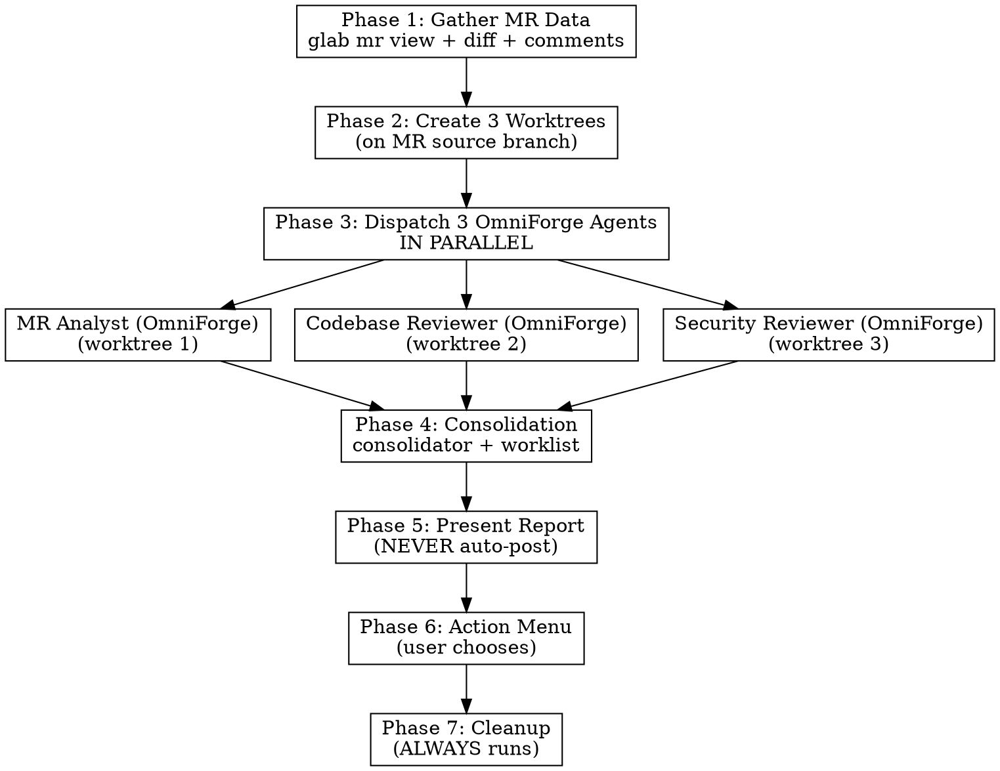

# OmniForge

> **Multi-agent adversarial MR review — 3 parallel agents, 3 worktrees, 1 consolidated report.**

Dispatch 3 parallel specialized agents in isolated git worktrees to perform adversarial, independent analysis of a GitLab MR. Consolidate findings via confidence scoring, present actionable report, then offer structured actions (comment, create issues, approve).

**Core principle:** Independent adversarial review + confidence filtering + worktree isolation = high-signal feedback with minimal noise.

**Announce at start:** "I'm using OmniForge to review MR !{id}."

## Prerequisites

- `glab` CLI authenticated (`glab auth status` to verify)
- Git repository with remote pointing to GitLab
- Current working directory is in the git repo

## Input Parsing

Accept any of: MR number (`136`), prefixed (`!136`), or full GitLab URL.
Extract MR ID. If URL provided, extract project path and MR IID.

## The Process



---

## Phase 1: Gather MR Data

Fetch ALL data before dispatching agents. Agents get data injected — they never re-fetch.

**Primary (all runs):** ONE invocation of the shipped gather script produces ONE JSON file
with everything Phase 1 needs — MR data, diff, diff_line_map, commits, AND every
discussion thread.

**Precondition:** `GITLAB_TOKEN` must be in the environment. If unset, extract it from the
authenticated host glab (never printed):
`export GITLAB_TOKEN=$(glab auth status --hostname <host> -t 2>/dev/null | sed -n 's/^.*- Token: //p')`

```bash
python3 "${CLAUDE_PLUGIN_ROOT}/skills/omnireview-gitlab/scripts/omni_fetch_mr.py" \
  --project {project} --mr {id} --out /tmp/omni_mr{id}_gather.json
```

The gather file carries the full package: mr_id, title, author, source_branch, target_branch,
pipeline_status, description, comments, diff, diff_line_count, diff_too_large, diff_truncated,
**diff_line_map**, diff_refs, commits, files_changed, labels, assignees, reviewers, plus the
embedded discussions envelope and versions. (If `${CLAUDE_PLUGIN_ROOT}` is not set in the
current context, construct the script path from this skill's own base directory plus
`scripts/omni_fetch_mr.py`.)

**IMPORTANT: `diff_line_map` is already included in this response.** It contains exact changed line numbers per file (added_lines, all_new_lines, hunks). When posting inline threads, use these line numbers directly — do NOT call `map_diff_lines` separately. The standalone `map_diff_lines` tool is only for re-parsing if you have a diff string from another source.

If `diff_too_large` is true, the diff is auto-truncated to 10,000 lines. Agents explore full files in their worktrees instead.

**Error handling:** the script's exit codes are the contract — 2 = usage/token (stderr names
the exact `glab auth status` extraction one-liner), 1 = API failure after bounded retries,
4 = head moved (see the Phase 3 STOP-guard). A gather failure stops Phase 1; report the
stderr line. (MCP fetch tools remain an optional convenience in interactive installs.)

**Fallback (personal skill install without MCP server):** Use bash commands directly:

```bash
glab auth status
glab mr view {id} -F json
glab mr view {id} -c
glab mr diff {id} --raw
git fetch origin {source_branch} {target_branch}
git log --oneline origin/{target_branch}..origin/{source_branch}
```

### Load balancing (before Phase 3 dispatch)

The Phase-1 gather file `/tmp/omni_mr{id}_gather.json` (its embedded data object is the fetch_mr_data envelope) feeds the shipped partitioner; keep partition.json:

```bash
python3 "${CLAUDE_PLUGIN_ROOT}/skills/omnireview-gitlab/scripts/omni_partition.py" \
  --mr-json /tmp/omni_mr{id}_gather.json --out /tmp/omni_partition_{id}.json
```

The partitioner assigns every changed file exactly one deep-dive owner: security-affinity files (auth/token/pipeline/SQL patterns) → Security Reviewer; docs/config files → MR Analyst; the remainder balanced by added lines across Codebase Reviewer / MR Analyst. Inject each agent's ownership table into its Phase 3 prompt via the `{OWNED_FILES}` placeholder: "Deep-dive owner: these files: <list>." + "Cross-cutting: you still sweep ALL changed files at grep depth; full-file reads are your owned files only." Every agent still covers every changed file — only full-file read depth is partitioned.

### Build the context digest

The gather file already embeds the discussions envelope — run the shipped digest on the ONE file (legacy two-file invocations still work; the digest detects both shapes):

```bash
python3 "${CLAUDE_PLUGIN_ROOT}/skills/omnireview-gitlab/scripts/omni_digest.py" \
  /tmp/omni_mr{id}_gather.json \
  --out-dir /tmp/omni_digest_{id} --prior-out /tmp/omni_mr{id}_prior_findings.json
```

When the digest's stdout line reports `retrospective: true`, the run declares RETROSPECTIVE mode: prior findings are authoritative context, never re-adjudicated. In retrospective runs inject `/tmp/omni_digest_{id}/digest.md` in place of raw `{MR_COMMENTS}` in all three agent prompts, and pass `/tmp/omni_mr{id}_prior_findings.json` to the Phase 3 prompts and the Phase 4 consolidation (`omni_consolidate.py --prior`). Bot-authored artifacts inside the digest are verbatim — the digest only ever truncates human prose and re-carried diff bodies (hunk headers + counts only). The digest degrades quietly (exit 0, `retrospective: false`) when the discussions file is missing or malformed — never block a run on it.

### Large Diff Strategy

When `diff_line_count` is high (>3000 lines) or `diff_truncated` is true:

1. **Don't inject the full diff into agent prompts.** Save the diff to a temp file and give agents the file path. They can read sections as needed.
2. **Provide a diff summary instead.** Use `files_changed` and `diff_line_map` to create a per-file summary table:
   ```
   | File | Added Lines | Hunks |
   |------|-------------|-------|
   | src/app.py | 42 | 3 |
   | tests/test_app.py | 28 | 2 |
   ```
3. **Agents explore in worktrees.** With the summary + worktree access, agents can read full files and understand context without the raw diff consuming their context window.
4. **Save diff to temp file pattern:**
   ```bash
   # Save diff for agents to read on-demand
   echo "$DIFF_TEXT" > /tmp/omni_mr{id}_diff.txt
   # Give agents the path, not the content
   ```
5. **Clean up temp files in Phase 7** alongside worktree cleanup.

This approach reduces agent context usage by 50-80% on large MRs while preserving full review quality.

---

## Phase 2: Create 3 Worktrees

**REQUIRED SUB-SKILL:** Follow `superpowers:using-git-worktrees` pattern.

**If MCP tools are available** (plugin install), use the single tool call:

```
mcp__omniforge__create_review_worktrees(
    mr_id="{id}",
    source_branch="{from Phase 1 response}",
    repo_root="{cwd}"
)
```

Returns absolute paths for all 3 worktrees:
- `worktrees.analyst` — MR Analyst (OmniForge)
- `worktrees.codebase` — Codebase Reviewer (OmniForge)
- `worktrees.security` — Security Reviewer (OmniForge)

The tool automatically: ensures `.worktrees/` exists and is gitignored, cleans stale worktrees from crashed runs, fetches the source branch, creates 3 detached worktrees, resolves absolute paths.

**Error handling:** If creation fails partway, the tool auto-cleans any partially created worktrees and returns `cleanup_performed: true`.

**Fallback (personal skill install without MCP server):**

```bash
# Resolve main repo root (handles linked worktrees)
MAIN_ROOT=$(git rev-parse --git-common-dir 2>/dev/null)
if [ -n "$MAIN_ROOT" ]; then MAIN_ROOT=$(cd "$(dirname "$MAIN_ROOT")" && pwd); else MAIN_ROOT=$(pwd); fi
cd "$MAIN_ROOT"

mkdir -p .worktrees
git check-ignore -q .worktrees 2>/dev/null || echo ".worktrees/" >> .gitignore
git worktree remove .worktrees/omni-analyst-{id} --force 2>/dev/null
git worktree remove .worktrees/omni-codebase-{id} --force 2>/dev/null
git worktree remove .worktrees/omni-security-{id} --force 2>/dev/null
git worktree prune
git fetch origin {source_branch}
git worktree add .worktrees/omni-analyst-{id} origin/{source_branch} --detach
git worktree add .worktrees/omni-codebase-{id} origin/{source_branch} --detach
git worktree add .worktrees/omni-security-{id} origin/{source_branch} --detach
ANALYST_PATH=$(cd .worktrees/omni-analyst-{id} && pwd)
CODEBASE_PATH=$(cd .worktrees/omni-codebase-{id} && pwd)
SECURITY_PATH=$(cd .worktrees/omni-security-{id} && pwd)
```

---

## Phase 3: Dispatch 3 OmniForge Agents in Parallel

**REQUIRED SUB-SKILL:** Use `superpowers:dispatching-parallel-agents` pattern.

**Before dispatching:** record the current unix epoch (`date +%s`) as `DISPATCH_EPOCH` — the waiter needs it as `--since`.

Dispatch all 3 agents simultaneously using the **Agent tool** (NOT TaskCreate — the Agent tool spawns subagents). Send a single message with 3 parallel Agent tool calls, dispatched in **background** mode so dispatch returns immediately. Each agent gets:
- Full MR context package (injected, NOT fetched by agent)
- Its own worktree **absolute** path for exploration
- Agent-specific review prompt (from template file)
- MR comments/discussions (all 3 agents, not just the MR Analyst)
- Confidence scoring instructions
- Instruction to end its final message with the line `Status: DONE` (completion fast-path for the waiter; completion still works without it via mtime stability)

**For each of the 3 dispatches, capture the `output_file` path from the Agent tool result** — that file is the agent's transcript and the waiter's primary input. Keep all 3 paths.

### Agent 1: MR Analyst (OmniForge)
- **Template:** `./references/mr-analyst-prompt.md`
- **Worktree:** `.worktrees/omni-analyst-{id}`
- **Focus:** Process quality — commit-by-commit analysis, MR description, discussions, scope

### Agent 2: Codebase Reviewer (OmniForge)
- **Template:** `./references/codebase-reviewer-prompt.md`
- **Worktree:** `.worktrees/omni-codebase-{id}`
- **Focus:** Code quality — architecture, logic, testing, patterns, DRY, performance

### Agent 3: Security Reviewer (OmniForge)
- **Template:** `./references/security-reviewer-prompt.md`
- **Worktree:** `.worktrees/omni-security-{id}`
- **Focus:** Security — OWASP Top 10, secrets, auth/authz, injection, data exposure

**Model selection:** Use the most capable model available (opus) for all 3 agents. Review requires judgment, not just mechanical work.

### Agent Prompt Construction

For each agent, fill the template placeholders:
- `{MR_ID}` — MR number
- `{MR_TITLE}` — MR title from JSON
- `{WORKTREE_PATH}` — **Absolute** path to agent's worktree (convert from relative)
- `{MR_JSON_DATA}` — Full JSON metadata (all 3 agents get this)
- `{MR_DESCRIPTION}` — MR description text
- `{MR_COMMENTS}` — All discussion threads (all 3 agents get this — discussions may contain security/code context). In retrospective runs (Phase 1 digest reported `retrospective: true`), substitute `/tmp/omni_digest_{id}/digest.md` here instead of the raw threads, and append the prior-findings one-liners from `/tmp/omni_mr{id}_prior_findings.json` to each prompt with: "these are already posted — do NOT re-report them"
- `{MR_DIFF}` — Raw diff output
- `{COMMIT_LIST}` — Commit SHAs and messages
- `{FILES_CHANGED_LIST}` — List of changed file paths
- `{OWNED_FILES}` — This agent's deep-dive ownership list from `/tmp/omni_partition_{id}.json` (Phase 1 load balancing): "Deep-dive owner: these files: <list>." Every agent still sweeps ALL changed files at grep depth — full-file reads are its owned files only
- `{SOURCE_BRANCH}` — MR source branch name
- `{TARGET_BRANCH}` — MR target branch name

### Wait for Completion: The Chunked Waiter (REQUIRED — replaces all sleeping)

After dispatch returns, wait for all 3 agents **only** with the shipped waiter. **Always pass `--reports-dir`** — the waiter writes its status JSON and one markdown report file per reviewer there (the Bash tool truncates large stdout and the Read tool truncates very long lines, so terminal stdout and single-giant-line JSON are both lossy channels at realistic report sizes; per-agent markdown files are the proven lossless path):

```bash
python3 "${CLAUDE_PLUGIN_ROOT}/skills/omnireview-gitlab/scripts/omni_wait.py" \
  --transcript "<output_file 1>" --transcript "<output_file 2>" --transcript "<output_file 3>" \
  --expect 3 --since <DISPATCH_EPOCH> \
  --reports-dir /tmp/omni_wait_out_{id}
```

If `${CLAUDE_PLUGIN_ROOT}` is not set in the current context, construct the path from this skill's own base directory (the directory containing this SKILL.md) plus `scripts/omni_wait.py`.

**The waiter's exit code is the SOLE completion authority:**
- **0** — all 3 transcripts terminal → proceed to Phase 4
- **3** — still running (or `count_pending`: fewer than 3 transcripts found but the dispatch epoch is still inside the 15 s spawn-grace window — keep re-invoking, it flips to `count_mismatch` once the grace expires) → immediately re-invoke the exact same command (each call is bounded by its own chunk timeout; loop 0→3→0→3 until you get 0 or 2)
- **2** — degraded (budget exhausted, every remaining agent stalled, or transcript count mismatch) → proceed to Phase 4 with partial results

**Before proceeding on exit 2, Read `/tmp/omni_wait_out_{id}/status.json` and confirm it parses as JSON and carries an `exit_reason` field.** If it does not (empty, error text, or absent), the INVOCATION itself is wrong — fix the command and re-run it; never proceed to consolidation without a valid status file.

Then **Read `/tmp/omni_wait_out_{id}/status.json`** — entries with `"state":"stalled"` or `"harvested_partial":true` are partial-output agents; `"state":"missing"` agents never produced a transcript. **For every agent whose entry has state terminal or stalled, Read its report file `/tmp/omni_wait_out_{id}/omni_wait-<transcript-basename>.md` — those files ARE the reviewers' reports (a stalled agent's file is its last partial report), and they are the inputs to Phase 4. Do NOT re-read the raw agent transcripts** (they are hundreds of KB of JSONL; the waiter already extracted the reports). After consolidation you may `rm -rf /tmp/omni_wait_out_{id}` (the waiter also wipes the dir's stale files on every invocation, so leftovers self-heal).

**Fallback when `output_file` paths are unavailable** (dispatch results lost): use scan-dir.

```bash
python3 "${CLAUDE_PLUGIN_ROOT}/skills/omnireview-gitlab/scripts/omni_wait.py" \
  --scan-dir "$CLAUDE_CONFIG_DIR/projects/<this-project-dir>/<session-id>/subagents" \
  --expect 3 --since <DISPATCH_EPOCH> \
  --reports-dir /tmp/omni_wait_out_{id}
```

Find the newest session directory for this project under `$CLAUDE_CONFIG_DIR/projects/`, point `--scan-dir` at its `subagents/` directory, and the waiter counts only `agent-*.jsonl` transcripts newer than `--since` (stale files from prior runs and the main session file are excluded automatically). Invoked immediately after dispatch, the fallback may find fewer than 3 transcripts because background agents have not spawned their transcript files yet — the waiter exits 3 (`count_pending`) during its 15 s grace window, so keep re-invoking; once the grace expires it flips to `count_mismatch` (exit 2). A persisting mismatch means ≠ 3 current reviewers — treat as degraded, never silently wait on fewer.

### NEVER improvise waiting (retired pattern — documented precedent of 8+ minutes dead wait)

This skill has documented history of agents improvising `sleep N` loops and hand-written `/tmp` collect scripts that burned 503 s AFTER all agents finished. Retired permanently:

- **NEVER** sleep between completion checks — no `sleep 115/240/300/420`, no `sleep N; <anything>` compound commands, not even sub-60 s sleeps (no `sleep 45`, no `sleep 5`)
- **NEVER** write, rewrite, or improvise collect/wait/poll helper scripts (`omni_collect.py` and friends) — the waiter is shipped, versioned, and tested
- **NEVER** treat background-agent task notifications as completion signals — they are informational only and documented-unreliable (runs where none of the 3 fired)
- The waiter's **exit code is the sole completion authority** — not notifications, not elapsed-time guesses, not transcript-size heuristics

### Degraded coverage

If the waiter exits 2 (or its JSON reports stalled/missing agents): do NOT re-dispatch, do NOT block, do NOT extend the wait. Consolidate whatever perspectives completed and proceed through Phase 4–7 normally. The final report MUST carry this note at the top of its Summary section:

**Coverage degraded (N/3 reviewers)** — missing: <which of MR Analyst / Codebase Reviewer / Security Reviewer>

On a stalled subagent (waiter status reports `stalled`, or a subagent died mid-response), attempt exactly ONE SendMessage resume before harvesting partials — never loop.

### Mid-run head-move guard (STOP protocol)

After the waiter exits (0 or 2) and BEFORE Phase 4 consolidation, verify the MR head has
not moved since the Phase-1 gather:

python3 "${CLAUDE_PLUGIN_ROOT}/skills/omnireview-gitlab/scripts/omni_fetch_mr.py" \
  --project {project} --mr {id} --verify-head <diff_refs.head_sha from /tmp/omni_mr{id}_gather.json>

Exit 0 → proceed to Phase 4. Exit 4 (head moved) → STOP, deterministically:
- NO re-partition, NO re-dispatch, NO new gather.
- Consolidate whatever completed (cheap, local) and present the report in your final message.
- Post EXACTLY ONE addendum note (a top-level note has no nested keys — glab api or the
  notes API is safe) and NO inline threads (stale anchors would mislead):

  ## OmniForge addendum — MR head moved mid-review

  Recorded head `{recorded}` moved to `{current}` while the review agents were running.
  Verdict at the recorded state: {VERDICT} ({N} findings >= 70 confidence — summary only,
  no inline threads posted because line anchors may be stale).
  This run STOPPED per protocol — no re-review was performed. Push a new commit and
  comment `/omnireview force` for a fresh review.

- Then Phase 7 cleanup as usual.

A SECOND identical `--verify-head` invocation runs immediately BEFORE the Phase 6 poster
call (same exit-4 STOP protocol + addendum path). Justification: a head move between
consolidation and posting means posting line numbers computed against a stale diff —
silently misanchored threads, the exact harm this guard exists to prevent (posting phases
historically ran ~15 min, so this window is real).

---

## Phase 4: Consolidation

**Threshold: 70.** Only findings with confidence >= 70 appear in the final report. The threshold applies to agent-assigned scores ONLY — never adjusted, never recomputed. Python never does confidence arithmetic; agents own their own scores.

**REQUIRED REFERENCE:** `./references/consolidation-guide.md` — you MUST read this before consolidating. The flow: (1) run `scripts/omni_validate_findings.py` on each waiter report from Phase 3, (2) run `scripts/omni_consolidate.py` on the validated findings files, (3) consume the generated `worklist.md` in ONE pass — top to bottom, in a single response, deciding each item from its quoted verbatim entries: no per-item re-verification loops, no re-deriving subagent evidence, no hand-merging, no severity-picking. Conflicts stay dual-perspective **Needs Human Judgment**. Auto clusters flow straight into the Phase 5 report. Any agent whose validator output says `passthrough: true` falls back to consolidating that agent's prose report directly (pre-3.3.0 behavior) — note the fallback in the final report's Summary. Do NOT attempt consolidation from memory — the algorithm has specific rules that must be followed exactly.

In retrospective runs (Phase 1 digest reported `retrospective: true`), pass `--prior /tmp/omni_mr{id}_prior_findings.json` to `omni_consolidate.py`: prior findings are AUTHORITATIVE context — the worklist's already_adjudicated section is carried forward as-is, never re-adjudicated. Open priors are replied on their recorded thread (`omni_post_review.py --reply-to` / per-entry `reply_to_thread_id`; MCP reply_to_discussion is optional in interactive installs) — never a new thread; resolved priors are never re-posted.

---

## Phase 5: Present Report

```markdown
## OmniForge Report: !{id} — {title}

**Branch:** {source} → {target} | **Author:** {author} | **Pipeline:** {status}

### Summary
[1-3 sentence executive summary: overall assessment, key risks]

### Verdict: [APPROVE | APPROVE_WITH_FIXES | REQUEST_CHANGES | BLOCK]

### Strengths
[Specific things done well with file:line references]

### Issues

#### Critical (Must Fix Before Merge)
[Bugs, security vulnerabilities, data loss risks]
Each: file:line | description | why it matters | how to fix | confidence | source agent(s)

#### Important (Should Fix)
[Architecture problems, missing edge cases, test gaps]

#### Minor (Nice to Have)
[Optimizations, documentation, code clarity]

### MR Process Notes
[From MR Analyst (OmniForge): commit quality, description, unresolved discussions]

### Security Assessment
[From Security Reviewer (OmniForge): OWASP findings, posture assessment]

### Recommendations
[Future improvements beyond this MR's scope]

### Agent Agreement Matrix
| File/Area | MR Analyst (OmniForge) | Codebase (OmniForge) | Security (OmniForge) | Consensus |
```

**CRITICAL: Present the report FIRST. Never auto-post anything.**

---

## Phase 6: Action Menu

After presenting the full report, offer structured actions:

```
What would you like to do?

1. Full review post — summary comment + inline discussion threads (Recommended)
2. Post summary only (overview comment, no inline threads)
3. Post inline findings only (discussion threads, no summary)
4. Create GitLab issues for Critical/Important items
5. Approve the MR
6. Open MR in browser
7. Re-review a specific area (single focused agent)
8. Verify a specific concern (run a targeted check)
9. Done — no action needed
```

Wait for user choice. Execute chosen action(s). Return to menu until user selects "Done".

### Option 1: Full Review Post (Recommended)

Post summary comment + individual inline threads for each finding >= 70 confidence. Each finding gets its own thread for independent resolution.

**REQUIRED REFERENCE:** `./references/posting-guide.md` — you MUST read this before posting anything. Contains the summary comment template, inline thread template, MCP tool call syntax (`post_full_review` findings JSON format), and bash fallback commands. Do NOT improvise posting format — use the exact templates from the reference.

**Posting path (all runs):** Post via the shipped `scripts/omni_post_review.py` (see posting-guide.md — retry/backoff, reply routing, duplicate-summary guard, `--dry-run`) — never improvised `/tmp` posting scripts. (MCP posting tools are optional in interactive installs.)
MR-meta findings with no diff locus (process notes, security posture) go in the same findings array as note entries — objects carrying only `body` — and the poster posts them as top-level MR notes after threads and replies. Never post general notes via raw `glab api --input -`: it silently drops note bodies (production: MR !1388 lost 5/5 notes that way). See posting-guide.md.
Immediately before posting, re-run the Phase-3 `--verify-head` check — exit 4 (head moved) = STOP protocol above.

---

## Phase 7: Cleanup

**ALWAYS runs, regardless of success or failure.**

**If MCP tools are available:**

```
mcp__omniforge__cleanup_review_worktrees(mr_id="{id}", repo_root="{cwd}")
```

The tool force-removes all 3 worktrees, cleans leftover directories, and prunes git worktree references. Reports what was removed vs. already clean.

**Fallback (personal skill install without MCP server):**

```bash
# Resolve main repo root (handles linked worktrees)
MAIN_ROOT=$(git rev-parse --git-common-dir 2>/dev/null)
if [ -n "$MAIN_ROOT" ]; then MAIN_ROOT=$(cd "$(dirname "$MAIN_ROOT")" && pwd); else MAIN_ROOT=$(pwd); fi
cd "$MAIN_ROOT"

git worktree remove .worktrees/omni-analyst-{id} --force 2>/dev/null
git worktree remove .worktrees/omni-codebase-{id} --force 2>/dev/null
git worktree remove .worktrees/omni-security-{id} --force 2>/dev/null
rm -rf .worktrees/omni-analyst-{id} .worktrees/omni-codebase-{id} .worktrees/omni-security-{id} 2>/dev/null
git worktree prune
```

**Temp files (both MCP and fallback paths):** also remove the Phase-1 artifacts in Phase 7 — `/tmp/omni_mr{id}_gather.json`, `/tmp/omni_mr{id}_data.json`, `/tmp/omni_mr{id}_discussions.json`, `/tmp/omni_mr{id}_prior_findings.json`, `/tmp/omni_digest_{id}/` (digest outputs), `/tmp/omni_partition_{id}.json`, and `/tmp/omni_mr{id}_diff.txt` (large-diff runs) — plus the Phase-4 consolidator outputs `/tmp/omni_consolidate_{id}/` (`clusters.json` + `worklist.md`) and Phase 6's `/tmp/omni_review_{id}_summary.md` and `/tmp/omni_review_{id}_findings.json` (posting inputs, if posting ran).

---

## Error Handling

| Error | Response |
|-------|----------|
| glab not authenticated | "Run `glab auth login` first." Stop. |
| MR not found | "MR !{id} not found. Verify the number and repository." Stop. |
| Network failure | Retry glab command once. If still fails, report error and stop. |
| Worktree creation fails | Try with timestamp suffix. If still fails, clean up and stop. |
| 1 agent fails | Continue with 2/3. Note gap in report. |
| 2+ agents fail | Present partial results. Suggest manual review. |
| Diff too large | Summarize diff. Give agents file list to explore in worktrees. |
| Cleanup fails | Force remove directories. Report if still stuck. |

**Cleanup guarantee:** The entire flow is wrapped in a try/finally pattern. Phase 7 runs no matter what.

---

## Quick Reference

| Phase | What | How |
|-------|------|-----|
| 1. Gather | Fetch MR data | `omni_fetch_mr.py` (one-shot JSON gather) |
| 2. Setup | Create 3 worktrees | `git worktree add --detach` (×3) |
| 3. Review | Dispatch OmniForge agents | Agent tool parallel (×3, opus model), then omni_wait.py exit-code loop |
| 4. Merge | Consolidate findings | `omni_validate_findings.py` + `omni_consolidate.py`, then consume `worklist.md` in ONE pass |
| 5. Report | Present OmniForge report | Structured markdown with verdict |
| 6. Act | User chooses | `glab mr note/approve`, `glab issue create` |
| 7. Clean | Remove worktrees | `git worktree remove --force` (×3) + prune |

---

## The "Small MR" Trap

```
EVERY MR gets the full OmniForge process. No exceptions.
```

The most dangerous rationalization is: "This MR is small/simple, I'll just do a quick review." This is exactly when issues get missed — when you assume simplicity means safety.

**Baseline testing proved this.** Without OmniForge, an agent reviewing a "simple" 86-line CI/CD change:
- Skipped worktree isolation ("unnecessary overhead")
- Skipped parallel agents ("scope was small enough")
- Skipped confidence scoring ("informal severity labels are fine")
- Read the wrong branch (local instead of MR source)
- Did no systematic security check (just "no issues found")

A CI/CD file change can expose secrets, break production deployments, or modify security configurations. "Small" does not mean "safe."

**The rule:** Every MR gets 3 OmniForge agents, 3 worktrees, confidence scoring, and the full report. The overhead is minutes. The cost of a missed issue is hours or days.

---

## Red Flags — STOP and Follow the Process

| Thought | Reality |
|---------|---------|
| "This MR is too small for full review" | Small MRs in CI/CD, auth, or config are the most dangerous. Full process. |
| "I'll just read the diff, no worktree needed" | The diff is insufficient. You need full file context. Create worktrees. |
| "One agent can handle this" | You'll miss cross-perspective insights. Dispatch all 3. |
| "I'll skip confidence scoring, findings are obvious" | "Obvious" findings are often false positives. Score everything. |
| "Let me just post my comments now" | Present the report first. User decides what to post. |
| "I can use the local branch instead of MR source" | The local branch may be stale or different. Always fetch and use MR source. |
| "Security review isn't needed for this change" | Every change has security implications. Always run the security agent. |
| "Cleanup can wait" | Stale worktrees accumulate. Clean up immediately. |
| "The MR comments aren't relevant for code/security review" | Discussions often contain security context, design decisions, and known risks. Inject comments into ALL agents. |
| "Relative paths are fine for worktrees" | Agents need absolute paths to reliably navigate. Always convert to absolute. |
| "I'll use TaskCreate to track the agents" | TaskCreate tracks YOUR work. Use the Agent tool to dispatch subagents. Different tools, different purposes. |

**All of these mean: Follow the 7-phase OmniForge process. No shortcuts.**

---

## Never

- Use `gh` (this is GitLab — use `glab` exclusively)
- Push to origin (user's rule: never push without explicit permission)
- Post comments without user approval from the action menu
- Approve MR without explicit user request
- Skip worktree cleanup (even on failure)
- Include findings below confidence threshold 70
- Let agents share worktrees (isolation is critical)
- Add AI attribution to posted comments (no "Generated by Claude" etc.)
- Skip any of the 7 phases for any reason
- Sleep-poll or improvise collect/wait helper scripts while waiting for reviewer agents (use the shipped waiter — its exit code is the sole completion authority)
- Never sleep-poll — not even sub-60 s sleeps (the shipped waiter is the only wait mechanism)

## Always

- Fetch MR data in Phase 1 before dispatching agents
- Create isolated worktrees per agent on the MR source branch
- Inject context into agent prompts (don't make agents re-fetch)
- Use confidence scoring with threshold 70
- Consolidate via `omni_consolidate.py` and consume its worklist in ONE pass (corroboration is metadata only — no hand-merging, no confidence arithmetic)
- Present full OmniForge report before any action
- Ask user which actions to take via the action menu
- Clean up all worktrees regardless of outcome
- Use `glab` for all GitLab operations

---

## Integration

**Uses:**
- `superpowers:using-git-worktrees` — Worktree setup/teardown pattern
- `superpowers:dispatching-parallel-agents` — Parallel dispatch pattern
- `superpowers:requesting-code-review` — Review output format (Strengths/Issues/Assessment)
- `superpowers:verification-before-completion` — Evidence-based findings

**OmniForge Agent Templates:**
- `./references/mr-analyst-prompt.md` — MR Analyst (OmniForge)
- `./references/codebase-reviewer-prompt.md` — Codebase Reviewer (OmniForge)
- `./references/security-reviewer-prompt.md` — Security Reviewer (OmniForge)
- `./references/consolidation-guide.md` — Cross-correlation and report format
